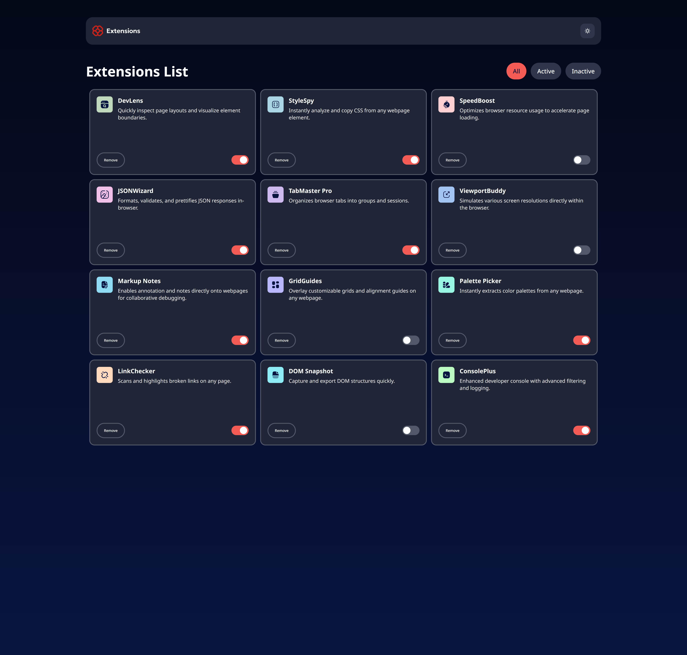

# Browser Extensions Manager UI

This is a solution to the [Browser Extensions Manager UI Challenge](https://www.frontendmentor.io/challenges/browser-extension-manager-ui-yNZnOfsMAp) on Frontend Mentor. The project is a responsive web application that enables users to manage browser extensions efficiently. Key functionalities include toggling extension states, filtering extensions, and removing them.

## Table of Contents

- [Overview](#overview)
  - [Features](#features)
  - [Screenshots](#screenshots)
  - [Live Demo and Solution](#live-demo-and-solution)
- [Technologies Used](#technologies-used)
- [Getting Started](#getting-started)
- [Project Structure](#project-structure)
- [Key Learnings](#key-learnings)
- [Author](#author)

---

## Overview

### Features

The application allows users to:

- Toggle extensions between active and inactive states.
- Filter extensions by categories: "All," "Active," or "Inactive."
- Remove extensions from the list.
- Switch between light and dark themes for better accessibility.
- Experience a responsive design optimized for both mobile and desktop devices.
- Interact with hover and focus states for all actionable elements.

### Screenshots




### Live Demo and Solution

- **Live Site**: [Visit the live site](https://your-live-site-url.com)
- **Solution**: [View the solution on Frontend Mentor](https://your-solution-url.com)

---

## Technologies Used

- **React**: For building a dynamic and interactive user interface.
- **TypeScript**: To ensure type safety and improve code maintainability.
- **CSS Modules**: For modular and reusable styling.
- **Vite**: For fast development and optimized builds.
- **Frontend Mentor Design**: As the foundation for the UI design.
- **LocalStorage**: To persist theme preferences across sessions.

---

## Getting Started

To set up the project locally, follow these steps:

1. Clone the repository:
   ```bash
   git clone https://github.com/your-username/browser-extensions-manager.git
   cd browser-extensions-manager
   ```
2. Install dependencies:
   ```bash
   npm install
   ```
3. Start the development server:
   ```bash
   npm run dev
   ```

---

## Project Structure

The project is organized as follows:

```
src/
├── components/        # Reusable UI components
│   ├── Button/        # Button component
│   ├── Container/     # Layout container
│   ├── ExtensionCards/ # Cards for displaying extensions
│   ├── FilterButtons/ # Buttons for filtering extensions
│   ├── Header/        # Header with logo and theme switch
│   ├── Logo/          # Logo component
│   ├── MainWrapper/   # Wrapper for the main layout
│   ├── Section/       # Section component
│   ├── SectionWrapper/ # Wrapper for sections
│   ├── ThemeSwitch/   # Theme toggle switch
│   └── ToggleSwitch/  # Toggle switch for extension states
├── contexts/          # React context for state management
│   ├── ExtensionContext.tsx
│   └── ThemeContext.tsx
├── data/              # Static data for extensions
│   └── data.json
├── hooks/             # Custom React hooks
│   ├── useExtension.ts
│   └── useTheme.ts
├── App.tsx            # Main app component
├── index.css          # Global styles
├── main.tsx           # Entry point
└── vite-env.d.ts      # Vite environment types
```

---

## Key Learnings

This project provided valuable insights into:

- Building responsive layouts with React and CSS Modules.
- Managing state using React Context and custom hooks.
- Implementing theme toggling with LocalStorage.
- Structuring a scalable and maintainable codebase.

---

## Author

- **Frontend Mentor Profile**: [@AmanGupta1703](https://www.frontendmentor.io/profile/AmanGupta1703)
- **GitHub**: [@AmanGupta1703](https://github.com/AmanGupta1703)
- **Twitter**: [@thekunalgupta17](https://twitter.com/thekunalgupta17)
